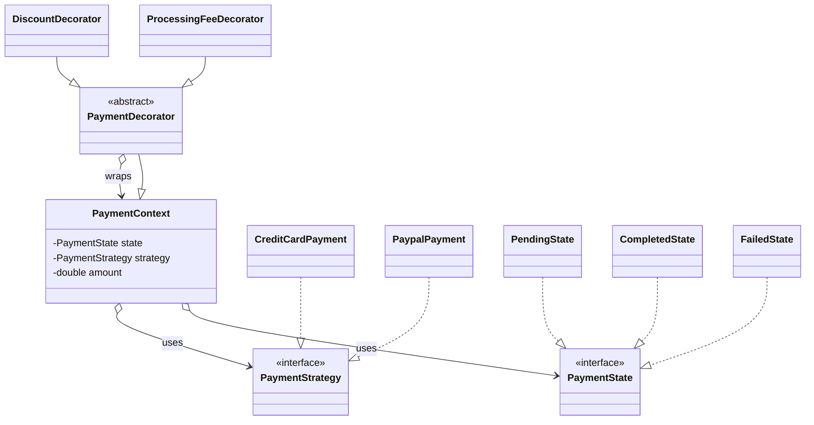

```mermaid
classDiagram
    class PaymentContext {
        -PaymentState state
        -PaymentStrategy strategy
        -double amount
    }
    PaymentContext o--> PaymentState : uses
    PaymentContext o--> PaymentStrategy : uses

    class PaymentStrategy {<<interface>>}
    CreditCardPayment ..|> PaymentStrategy
    PaypalPayment ..|> PaymentStrategy

    class PaymentState {<<interface>>}
    PendingState ..|> PaymentState
    CompletedState ..|> PaymentState
    FailedState ..|> PaymentState

    class PaymentDecorator {<<abstract>>}
    PaymentDecorator --|> PaymentContext
    ProcessingFeeDecorator --|> PaymentDecorator
    DiscountDecorator --|> PaymentDecorator
    PaymentDecorator o--> PaymentContext : wraps
```

